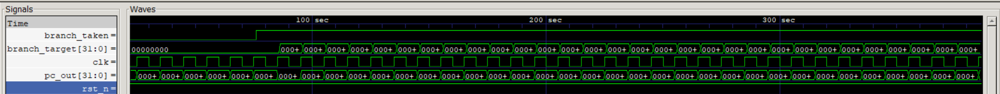
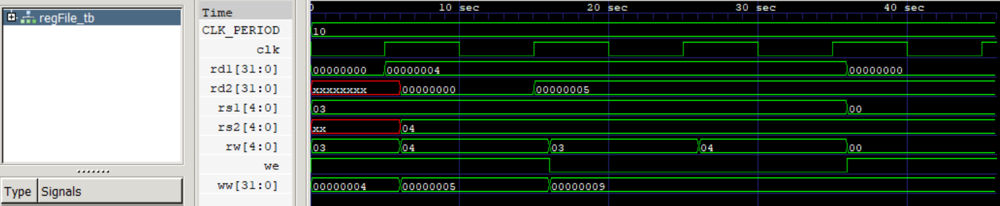

# May 6 2026:
**working on: Program Counter**

Today is the first day working on the CPU. 

The main problem I had was remembering the notation for setting vectors to numbers, i.e: `a = 32'h0` (Note that 'h (hexadecimal) vs 'd (decimal)). Another thing to remember is that the reset should be asynchronous for this application.

# May 8 2026:
**working on: Program Counter Test Bench**

The methodology I had for the testbench was to think of all the reasonable configurations that the PC could end up in and then run all of them, whether that be through a for loop or in the case of the reset just the one test.

Some things I learned, when writing testbenches `module pc_tb;` uses a semicolon but doesnt need contents, which is differenct from the actual code. 

**Problem:** forever block made code last forever for the clock set up

**Fix:** use an always block `always #(CLK_PERIOD/2) clk = ~clk;` 

**Problem:** Simulation ran for 150k seconds

**Fix:** Missing `$finish` at end of initial block

# May 9 2026:
**working on: Imem, Imem tb, regFile, regFile tb**

Now that I'm getting in the flow of things, it is all going faster, I was able to write 4 scripts today.

**Problem:** most of the problems today were syntax based, like using semicolons instead of commas in the logic of module declarations and using `@(posedge clk); #1;` instead of `#(posedge clk); #1;`

#  May 10 2026:
**working on: alu**

Today I started work on the ALU, but got a little bit stuck on a few of the cases for the ALU, so I've spent most of my time reading through the RISC-V manual.

# May 17-18 2026
**working on: alu and ImmGen along with respective testbenches**

I had to take a week off to focus on preparing for URC, but I have a few days to continue before the comp now. 

I managed to get the ALU working with minimal hassle, but to understand the immgen a little better I started looking into assembly and learned some things along the way. First the RISCV manual was very helpful for providing diagrams to help with the design process. but I learned that for testbenches you don't want to use the same logic that you have in the module, as that will always give a success even if the logic is wrong. This seems obvious in retrospect but its good to know now. also sv wise I learned its good to use 3 eqaul signs in the if statements as it can catch some smaller formatting errors that 2 wouldnt.

# June 7th 2026
**working on: ControlUnit, ALUdecoder, DataMem and testbenches**

I took a good bit of time off to go to Utah for URC, which was a great experience, but now I'm back and ready to start working again. Today was mostly finishing up the controlunit and ALUdecoder testbenches, I finished the modules over the last little bit, and most of this was spent fighting modelsim, which I started using because Icarus didn't like the verification method I chose. But I learned that .randomize() was exclusive to premium modelsim, which I do not have, so that solved that problem. Then my other key problem was trying to have two testbenches in one file, which seemed not to work well.

# Aug 7th

I haven't documented in a little bit but something very interesting just happened that I wanted to save. So I have my python script which auto generates machine code to make a CRT for testing the cpu. Then I would run the assembly through my cpu and through a verified working method, such as the online venus site. The main issue I found was my CPU was failing 8-9 out of 10 times from my random CRT. After looking instruction by instruction I noticed that when something wa being written the the registers when the ALU was taking that register in the same clock cycle, it would break. I fixed this by making a combinational assignment which hardwires the input to the register if the ALU is calling for the same value that is being written to.

After that it was passing basically every one, so I decided to increase it to 20000 instructions, and then it started failing again. For this, I needed to make 3 fixes, the first one was simple, in my program counter, I was changing it even when the enable was low. Then, a little more complicated, but when forwarding a value after a lw instruction, I wasn't taken iinito account that it was a memmory operation, and therefore needed to wait until the MEM stage before taking the value, and due to that, It would grab a non-existant value effectivley and add it